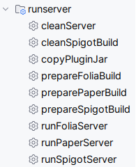
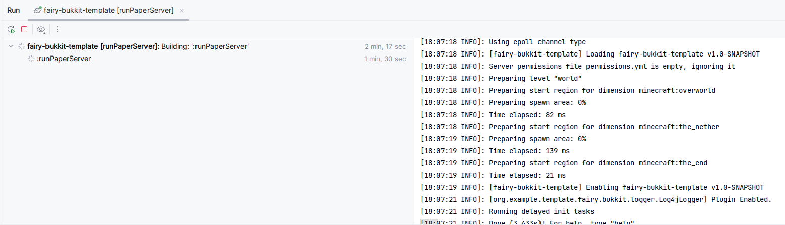

import Tabs from '@theme/Tabs';
import TabItem from '@theme/TabItem';

# Preparing Environment

Before we start developing our plugin, we need to set up our environment. This guide will help you set up your environment for Fairy plugin development.

## Prerequisites
- [Java Development Kit (JDK)](https://www.oracle.com/java/technologies/javase-jdk11-downloads.html) 8 or higher, choose the JDK version according to the spigot version you are using.
    - `JDK 8` for Spigot 1.8.x to 1.16.x
    - `Java 17` for Spigot 1.17.x and Spigot 1.20.4
    - `Java 21` for Spigot 1.20.5 or above and Fairy framework itself
- [Gradle](https://gradle.org/install/) 8.0 or higher
- [IntelliJ IDEA](https://www.jetbrains.com/idea/download/) or any other Java IDE

:::info

If you are contributing to Fairy framework itself, you'll need JDK 21 or above to build Fairy.

:::

---
## Setting up the project

Great job! You have all the prerequisites installed. Now, let's set up the project.

### Step 1: Create repository the Fairy template

Good news to you! we have template projects that allows you to start developing your plugin right away. Choose the template that fits your needs:

<Tabs>
    <TabItem value="bukkit-gradle" label="Bukkit & Gradle" default>
        ***GitHub Repository***

        https://github.com/FairyProject/fairy-bukkit-template

        ***Git Clone***
        ```
        git clone https://github.com/FairyProject/fairy-bukkit-template
        ```
    </TabItem>
    <TabItem value="bukkit-maven" label="Bukkit & Maven">
        Unfortunately, we don't have a Maven template for Bukkit yet. Check [HERE](https://github.com/FairyProject/fairy/issues/96) to track the progress.
    </TabItem>
</Tabs>

:::tip

We recommend you to use the **Create Template** feature on GitHub to create a new repository from the template, and clone that instead.
So you can easily update your project with the latest changes from the template.

:::

---
### Step 2: Edit project settings

Tada! You have successfully cloned the repository with the full functionality of Fairy framework. Now, let's edit the project settings.

Go to `gradle.properties` file and edit the following properties:

-------------------------
| Setting              | Description                                                                                                                                                                      |
|----------------------|----------------------------------------------------------------------------------------------------------------------------------------------------------------------------------|
| **`group`**          | Basically the reverse domain name of your project. For example, `com.example.myplugin` from `myplugin.example.com`.                                                              |
| **`name`**           | Give your project a cool name!                                                                                                                                                   |
| **`version`**        | Good to start with `1.0-SNAPSHOT`.                                                                                                                                               |
| **`spigot.version`** | The version of Spigot you are using. For example, `1.17.1`. This settings is important as it changes the Spigot API it's using and the Spigot jar it's downloading.              |
| **`lib.plugin`**     | Wether you are developing the plugin with a external plugin [fairy-lib-plugin](https://github.com/FairyProject/fairy-lib-plugin) or not. We will cover this in the next section. |

Next! go to `settings.gradle.kts` file and edit the `rootProject.name` to your project name.

And perfect! You successfully have a fully functional project with Fairy framework.

---
### Step 3: fairy-lib-plugin? What's that?

Fairy framework is a very big framework by itself, including the entire framework into your plugin may not be the best idea. That's why we have [fairy-lib-plugin](https://github.com/FairyProject/fairy-lib-plugin).

[fairy-lib-plugin](https://github.com/FairyProject/fairy-lib-plugin) is a plugin that includes all the Fairy framework dependencies, so you don't have to include them in your plugin. This makes your plugin smaller and easier to manage.

If you wish to publish the plugin to platform like [SpigotMC](https://www.spigotmc.org/) for example, you may want to include the Fairy framework dependencies in your plugin. In this case, you can set `lib.plugin` to `true` in `gradle.properties`.

---
### Step 4: Get it running!

Perfect! You have set up your project. Now, let's run the project.

Fairy has a built-in functionality to run a debug server with the plugin. To run the server, simply run the following command:

<Tabs>
    <TabItem value="spigot" label="Spigot">
        ```shell
        ./gradlew runSpigotServer
        ```
    </TabItem>
    <TabItem value="paper" label="Paper">
        ```shell
        ./gradlew runPaperServer
        ```
    </TabItem>
    <TabItem value="folia" label="Folia">
        ```shell
        ./gradlew runFoliaServer
        ```
    </TabItem>
</Tabs>

:::tip

Alternatively, if you are using IntelliJ IDEA, you can run the server by clicking the `runSpigotServer`, `runPaperServer`, or `runFoliaServer` task in the Gradle tab.



:::

Let's go! The plugin runs flawlessly on the server!



---
### Step 5: Ship it!

Everything is all set up! Now we gonna compile and ship the plugin. Simply run the following command:

```shell
./gradlew shadowJar
```

The plugin jar will be generated in `build/libs` directory.

And that's it! You have successfully set up your environment for Fairy plugin development. Now, you can start developing your plugin with Fairy framework.

