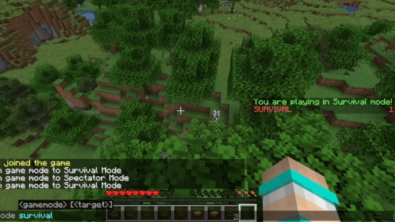

import Tabs from '@theme/Tabs';
import TabItem from '@theme/TabItem';

# Multi Sidebars

## Providers
Now you know how to make a basic [sidebar](/modules/sidebar) with a single provider, we also support multiple providers to enhance your plugin structure!

Let's say I want the sidebar to have different variants between 4 of the gamemodes, we can do that by creating multiple providers.

<Tabs>
    <TabItem value="survival" label="SurvivalSidebarProvider.java">

        ```java

        @InjectableComponent
        public class SurvivalSidebarProvider implements SidebarProvider {
            @Override
            public @Nullable Component getTitle(@NotNull MCPlayer mcPlayer) {
                return Component.text("You are playing in Survival mode!", NamedTextColor.GREEN);
            }

            @Override
            public @Nullable List<SidebarLine> getLines(@NotNull MCPlayer mcPlayer) {
                return Arrays.asList(
                    SidebarLine.of(Component.text("SURVIVAL", NamedTextColor.RED))
                );
            }

            @Override
            public boolean shouldDisplay(@NotNull MCPlayer mcPlayer) {
                return mcPlayer.getGameMode() == GameMode.SURVIVAL;
            }
        }

        ```

    </TabItem>
    <TabItem value="creative" label="CreativeSidebarProvider.java">

        ```java

        @InjectableComponent
        public class CreativeSidebarProvider implements SidebarProvider {
            @Override
            public @Nullable Component getTitle(@NotNull MCPlayer mcPlayer) {
                return Component.text("You are playing in Creative mode!", NamedTextColor.AQUA);
            }

            @Override
            public @Nullable List<SidebarLine> getLines(@NotNull MCPlayer mcPlayer) {
                return Arrays.asList(
                    SidebarLine.of(Component.text("CREATIVE", NamedTextColor.RED))
                );
            }

            @Override
            public boolean shouldDisplay(@NotNull MCPlayer mcPlayer) {
                return mcPlayer.getGameMode() == GameMode.CREATIVE;
            }
        }

        ```

    </TabItem>
    <TabItem value="adventure" label="AdventureSidebarProvider.java">

        ```java

        @InjectableComponent
        public class AdventureSidebarProvider implements SidebarProvider {
            @Override
            public @Nullable Component getTitle(@NotNull MCPlayer mcPlayer) {
                return Component.text("You are playing in Adventure mode!", NamedTextColor.GOLD);
            }

            @Override
            public @Nullable List<SidebarLine> getLines(@NotNull MCPlayer mcPlayer) {
                return Arrays.asList(
                        SidebarLine.of(Component.text("ADVENTURE", NamedTextColor.RED))
                );
            }

            @Override
            public boolean shouldDisplay(@NotNull MCPlayer mcPlayer) {
                return mcPlayer.getGameMode() == GameMode.ADVENTURE;
            }
        }

        ```

    </TabItem>
    <TabItem value="spectator" label="SpectatorSidebarProvider.java">

        ```java

        @InjectableComponent
        public class SpectatorSidebarProvider implements SidebarProvider {
            @Override
            public @Nullable Component getTitle(@NotNull MCPlayer mcPlayer) {
                return Component.text("You are playing in Spectator mode!", NamedTextColor.GRAY);
            }

            @Override
            public @Nullable List<SidebarLine> getLines(@NotNull MCPlayer mcPlayer) {
                return Arrays.asList(
                        SidebarLine.of(Component.text("SPECTATOR", NamedTextColor.RED))
                );
            }

            @Override
            public boolean shouldDisplay(@NotNull MCPlayer mcPlayer) {
                return mcPlayer.getGameMode() == GameMode.SPECTATOR;
            }
        }

        ```

    </TabItem>
</Tabs>



---
## Priority

Every sidebar provider contains a method to set the priority of the sidebar, the higher the priority, the higher the sidebar will be displayed.
If one of the sidebar has been displayed, the sidebar with lower priority will be hidden.

```java
@Override
public int getPriority() {
    return 0;
}
```