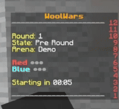
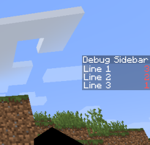

import Tabs from '@theme/Tabs';
import TabItem from '@theme/TabItem';

# Sidebar
Allows you to make this in minutes.



## Adding the sidebar module

In your module build.gradle, please add the following dependency:

<Tabs>
    <TabItem value="groovy" label="Groovy">

        ```groovy
        dependencies {
        api 'io.fairyproject:mc-sidebar'

        // Other dependencies
    }
        ```

    </TabItem>
    <TabItem value="kotlin-dsl" label="Kotlin DSL">

        ```kotlin
        dependencies {
        api("io.fairyproject:mc-sidebar")

        // Other dependencies
    }
        ```

    </TabItem>
</Tabs>

---
## Creating a Sidebar

To create a Sidebar, you'll first need to a class that implements `SidebarProvider` interface.

```java
import io.fairyproject.mc.sidebar.SidebarProvider;
import io.fairyproject.sidebar.SidebarLine;
import io.fairyproject.sidebar.SidebarProvider;
import net.kyori.adventure.text.Component;

// Make sure you have this class a component!
//highlight-next-line
@InjectableComponent
public class DebugSidebarProvider implements SidebarProvider {
    @Override
    public @Nullable Component getTitle(@NotNull MCPlayer mcPlayer) {
        return Component.text("Debug Sidebar");
    }

    @Override
    public @Nullable List<SidebarLine> getLines(@NotNull MCPlayer mcPlayer) {
        return Arrays.asList(
                SidebarLine.of(Component.text("Line 1")),
                SidebarLine.of(Component.text("Line 2")),
                SidebarLine.of(Component.text("Line 3"))
        );
    }
}
```

And tada! launch the test server, and you'll see the sidebar on the right side of the screen.



:::tip

Fairy automatically scans components with `SidebarProvider` interface and registers them to the sidebar.
If you want to do it manually, you can use `SidebarService.addProvider(SidebarProvider)`.

:::

---
## Refreshing the Sidebar

Perfect! the sidebar is here, but what if you want to update the sidebar content?

Well... you don't! Fairy will automatically update the sidebar content **every 2 ticks**.
All you need to take care is the content to display in the getTitle and getLines function.
So let's say I want to display the coordinates of the player in the sidebar.
All I have to do is to return the player's coordinates in the getLines function.

```java
@Override
public @Nullable List<SidebarLine> getLines(@NotNull MCPlayer mcPlayer) {
    return Arrays.asList(
            SidebarLine.of(Component.text("X: " + mcPlayer.getPosition().getBlockX())),
            SidebarLine.of(Component.text("Y: " + mcPlayer.getPosition().getBlockY())),
            SidebarLine.of(Component.text("Z: " + mcPlayer.getPosition().getBlockZ()))
    );
}
```


---
## Score Format

As of 1.20.3, you are now able to set the score format of the sidebar. And yes, we provide the functionality to set the score format!

```java
    @Override
    public @Nullable List<SidebarLine> getLines(@NotNull MCPlayer mcPlayer) {
        return Arrays.asList(
                SidebarLine.of(Component.text("Blank Score"), ScoreFormat.blankScore()),
                SidebarLine.of(Component.text("Styled Score"), ScoreFormat.styledScore(Style.style()
                                .color(NamedTextColor.AQUA)
                        .build())),
                SidebarLine.of(Component.text("Custom Score"), ScoreFormat.fixedScore(Component.text("I'm Score")))
        );
    }
```

:::warning

It will not be displayed for clients or servers under 1.20.3.

:::

---
## Hide the Sidebar

Sometimes you may want to hide the sidebar, and there is several ways to do it.
1. Return null in the getTitle or getLines function.
2. Return an empty list in the getLines function.
3. Implement the `shouldDisplay(MCPlayer)` function and return false.

```java
@Override
public boolean shouldDisplay(@NotNull MCPlayer mcPlayer) {
    return mcPlayer.getGameMode() == GameMode.CREATIVE;
}
```

And the sidebar will be hidden when the player is in creative mode!